## 简介

- **Tour_Admin**是一个旅游网站的后台管理系统

- 可以实现对旅游网站以下相关信息的管理
  - 产品订单基础信息
  - 用户权限信息
  - 用户日志信息

## 主要技术

- 前端：
  - `jsp`：页面展示
  - `AdminLTE`：基于`bootstrap`的后台页面模板
- 后端：
  - `spring`：整合所有框架，ioc 降低代码耦合，aop 利用反射增强代码功能
  - `spring-mvc`：控制层框架，使用 mvc 模型中的控制层，更方便的和前端进行交互
  - `mybatis`：持久层框架，更方便的和数据库进行数据交互
  - `spring-security`：安全框架，用于登陆验证，密码加密，权限控制
  - `jsr250`：数据校验
  - `tomcat8`：web 网络服务器
- 数据库（使用开源的`mysql5.7`数据库）：
  - 权限管理 5 张表：用户信息，用户角色信息，角色权限信息
  - 订单管理 5 张表：处理了订单信息，游客信息，产品信息，会员信息
  - 日志管理 1 张表：存储操作记录相关日志

## 数据库信息

|            订单管理             |           权限管理            |             日志管理              |
| :-----------------------------: | :---------------------------: | :-------------------------------: |
| 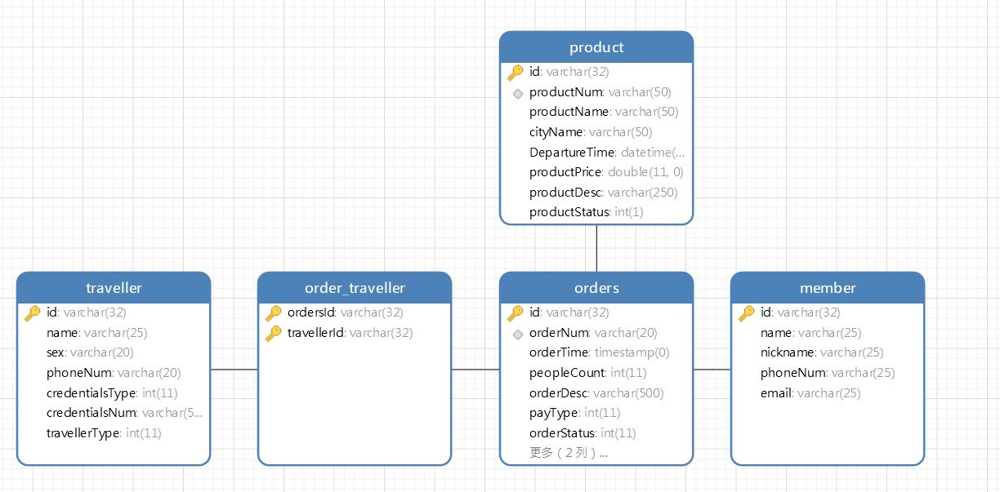 | 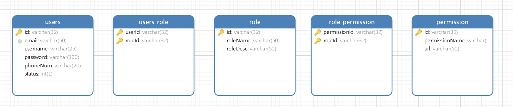 | 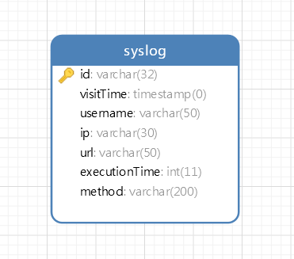 |

## 详细介绍

### 登录系统

- 页面展示
  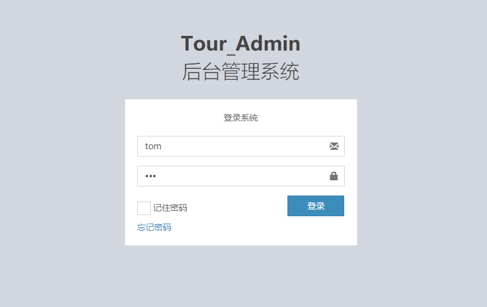
- 功能
  - 用户输入用户名密码，发送 post 请求
  - 经过`spring-security`处理，登录 Tour_Admin 后台管理系统
  - 查询数据库中的账户信息，无误后进入后台管理系统主页

### 基础信息管理系统

#### 主页

- 页面展示
  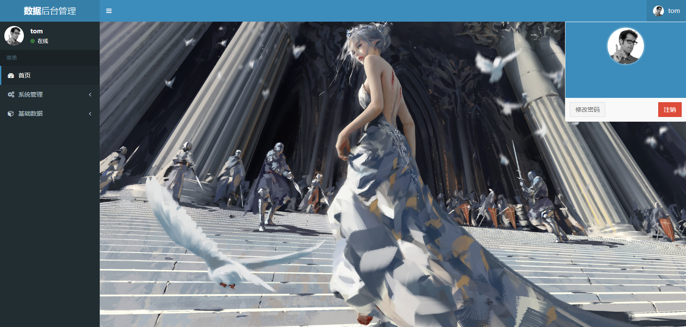
- 功能

  - 根据用户信息回显用户名称信息
  - 右上角提供注销登录功能
  - 左边导航栏提供**系统管理**和**基础数据**功能

  |           系统管理            |           基础数据            |
  | :---------------------------: | :---------------------------: |
  | 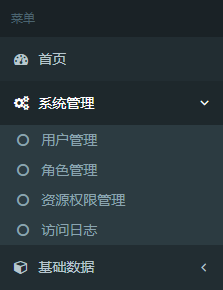 | 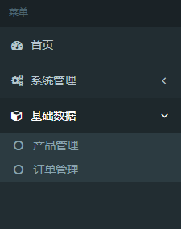 |

#### 产品管理

> 实现了基础的 crud 操作

##### 产品列表

- 页面展示
  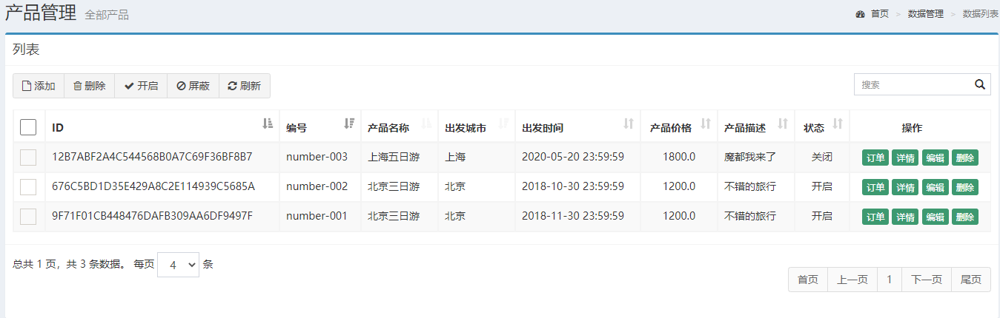
- 功能
  - 展示所有产品信息

##### 产品添加

- 页面展示
  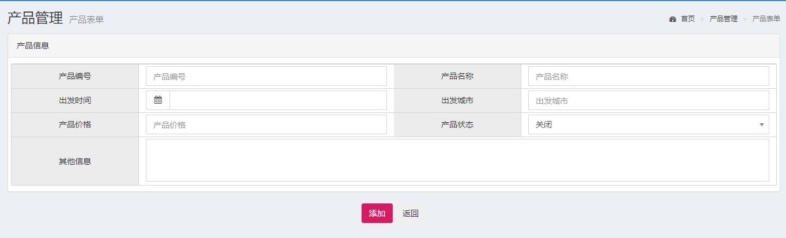
- 功能
  - 添加新的产品

##### 产品修改

- 页面展示
  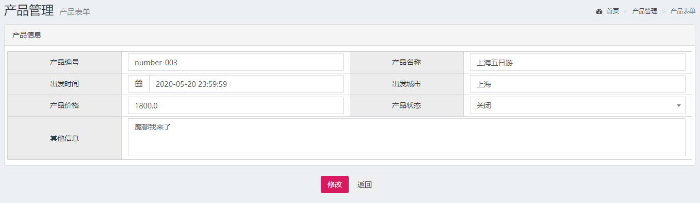
- 功能
  - 修改已有的产品信息

##### 产品删除

- 页面展示
  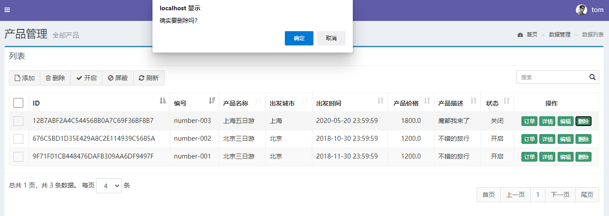
- 功能
  - 删除已有的产品

#### 订单管理

> 实现了基础的 crud 操作，基本与`产品管理`相同，但在底层使用了多表查询，与上述功能相似的地方不再赘述

##### 订单列表

- 页面展示
  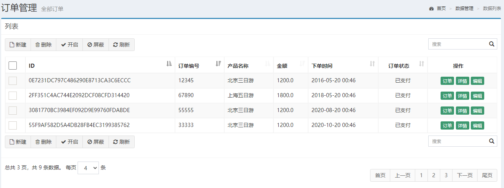
- 功能
  - 展示所有订单信息和订单**关联的**产品信息

##### 订单详情

- 页面展示
  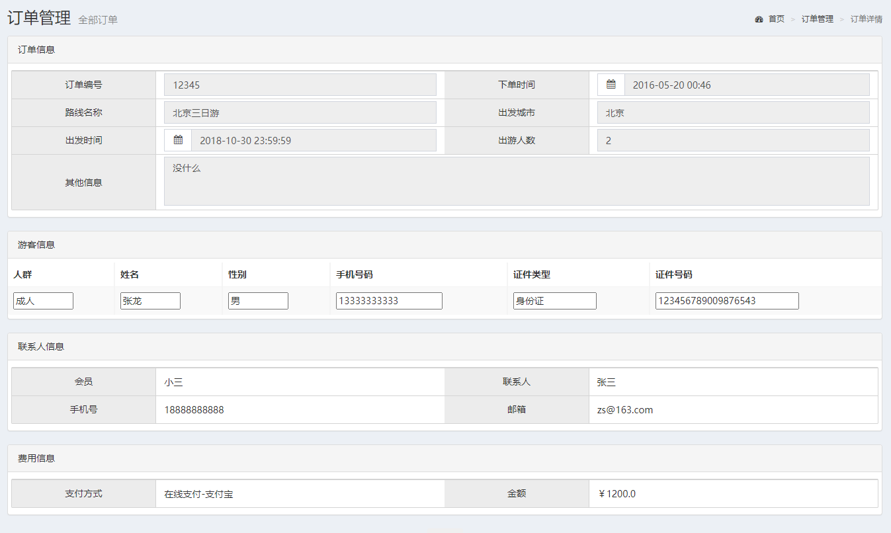
- 功能
  - 展示指定订单的信息和订单**关联的**产品信息，会员信息，游客信息

### 权限管理系统

> 实现了基础的 crud 操作，通过多表查询实现权限管理

- 权限管理系统包括用户管理，角色管理，资源权限管理三部分
- 实现了控制特定用户访问授权的页面，执行授权的方法，如下图所示，在控制页面展示的同时，也控制了直接输入`url`的方式进行访问
  | tom | fox |
  | :---------------------------: | :---------------------------: |
  |  | 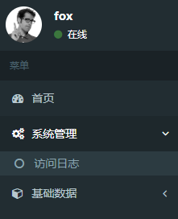 |

#### 用户管理

##### 用户列表

- 页面展示
  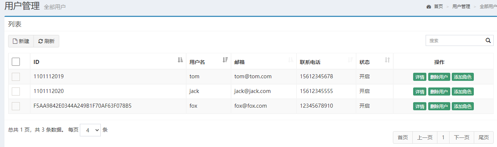
- 功能
  - 展示所有用户信息，可以对用户进行 crud 操作
  - 可以给用户添加角色，如：`ADMIN`，`USER`

##### 用户详情

- 页面展示
  
- 功能
  - 展示指定用户的详细信息（角色，权限）

#### 角色管理

##### 角色列表

- 页面展示
  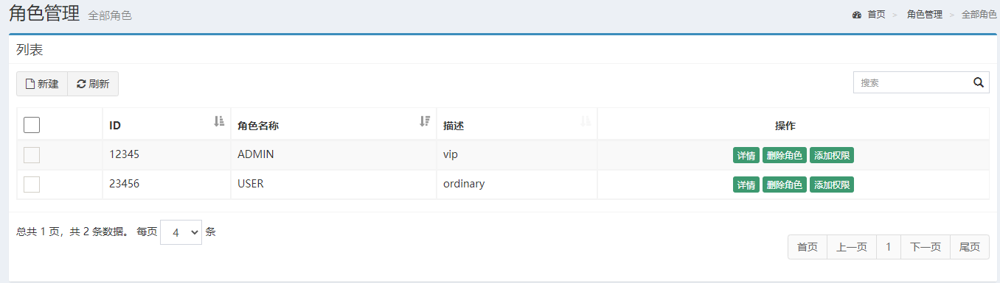
- 功能
  - 展示所有角色信息，可以对角色进行 crud 操作
  - 可以给角色添加权限，如：`find`，`edit`等

#### 资源权限管理

##### 资源权限列表

- 页面展示
  
- 功能

  - 展示所有资源权限信息，可以对资源权限进行 crud 操作
  - 可以给资源权限添加相应的`url`，如：`users`，`products`等

### 日志系统

> 后台利用反射技术和 AOP 技术，生成用户访问日志，并存入数据库，前台网页实现对相关日志的查询和管理

- 页面展示
  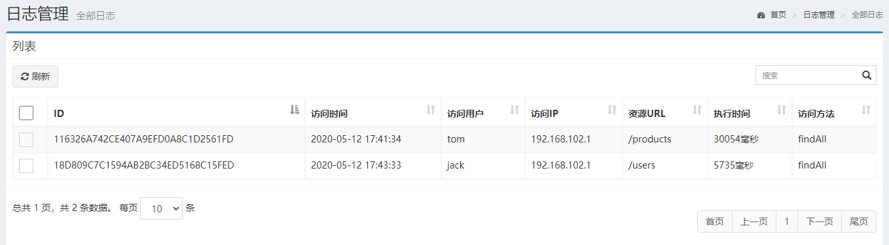
- 功能
  - 展示所有日志信息，便于系统维护和管理
